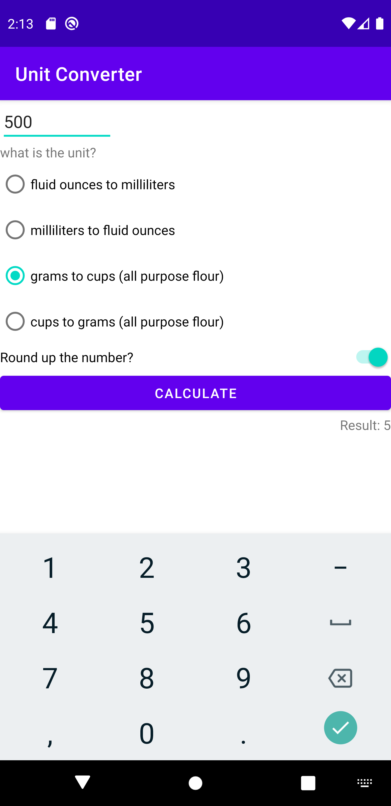

# UnitConverter
unit converter for cooking

<video autoplay loop muted playsinline>
    <source src="unitConverter.webm" type="video/webm">
    <source src="unitConverter.mp4" type="video/mp4">
    Your browser does not support HTML5 video.       
    <a href="unitConverter.gif">Click here to view original GIF</a>
</video>

<video>
    <source src="unitConverter.webm" type="video/webm">
    <source src="unitConverter.mp4" type="video/mp4">
    
</video>
